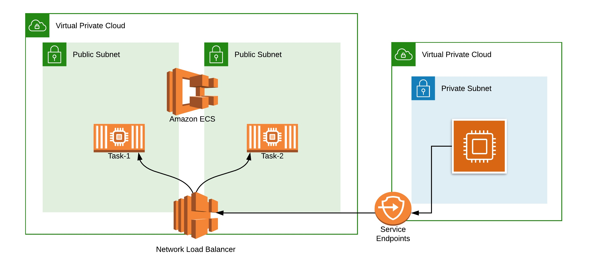

# Bringing Squid Proxy into the 21st century with AWS Fargate

## Overview

When talking about building and deploying applications in the AWS ecosystem, one topic that comes up without fail is how to securely manage outbound internet traffic from private subnets.

How can you operate a controlled environment that prevents data exfiltration or possible data leaks with a minimum amount of management overhead?

There are commercial tools available such as [NextGen Firewall](https://en.wikipedia.org/wiki/Next-generation_firewall) or [Web Proxy](https://en.wikipedia.org/wiki/Proxy_server) that can filter/block outbound web traffic but these tools require a license as well as ongoing maintenance of the software and the related AWS EC2 infrastructure.

AWS has published an excellent article on [How to Add DNS Filtering to Your NAT Instance with Squid](https://aws.amazon.com/blogs/security/how-to-add-dns-filtering-to-your-nat-instance-with-squid/), that covers the reasons for choosing a Squid-based solution to solve this problem.

Inspired by this solution, I want to take the architecture and apply modern AWS technologies like AWS Fargate and the Network Load Balancer to bring the solution into the cloud-native realm.

[Squid](http://www.squid-cache.org/) is chosen as open-source software to whitelist and blacklist URL, and combined with [Linux Alpine](https://alpinelinux.org/), fits perfectly in a container environment.

## Diagram

<p align="center">
  
</p>

## Principles

The solution is based on the following principles:

- Provides a secure internet connection to a wide AWS landscape (multi-account/ multi-region)
- No Servers to Maintain/Update/Upgrade
- Needs to support high bandwidth throughput
- Highly available solution
- Flexible cost based on usage


# The solution

This solution combines Infrastructure As A Code (IaaC) using [Terraform](https://www.terraform.io/) and the AWS ECS deploying a strategy to update the configuration of the Squid Farm, using a zero-downtime strategy.

This solution enabled:

- Internet access using a proxy with a controlled whitelist/blacklist
- Avoid using AWS VPC peering with complex routing simply relying on AWS Service Endpoint
- ECS provides the high-availability scheduling with the required AWS Fargate scaling based on the CPU load of the service
- No Patch/Updates will be required anymore to maintain the base OS


# Terraform parameters

## Terraform Version

This module support Terraform `>= 0.12.0` in this repo `example.tf` show how to use it

## Input for AWS Infrastructure

| Name | Description | Type | Default | Required |
|------|-------------|:----:|:-----:|:-----:|
| aws\_region | AWS region | string | `` | yes |
| vpc\_id | VPC ID | string | `` | yes |
| lb\_subnets | A list of Loadbalancer subnets inside the VPC | list | `[]` | yes |
| fargate\_subnets | A list of subnets inside the VPC for Fargate | list | `[]` | yes |
| environment | Environment name | string | `dev` | no |
| app\_name | Application name | string | `utm-squid` | no |
| app\_port | Application TCP Port | string | `3128` | no |
| fargate_image | Fargate Image | string | `cloudreach/squid-utm:1.0` | no |
| desired\_count | Fargate instance count | string | `2` | no |
| max\_count | Max Fargate instance count | string | `30` | no |
| extra\_tags | Additional tags to all tagged resources | map | `{}` | no |
| internal | Loadbalancer usage internal or not | string | `false` | no |
| health\_check\_interval | Loadbalancer health check interval | string | `30` | no |
| deregistration\_delay | time of deregistering target from draining to unused | string | `5` | no |


## Input for Squid Config

| Name | Description | Type | Default | Required |
|------|-------------|:----:|:-----:|:-----:|
| whitelist\_aws\_region | URL filter for AWS region | string | `eu-west-1,eu-west-2,eu-central-1` | no |
| whitelist\_url | permitted URL filter | string | `www.cloudreach.com,www.google.com` | no |
| url\_block\_all | deny all other access to this proxy | string | `false` | no |
| blacklist\_url | blocked URL filter | string | `www.exploit-db.com` | no |
| allowed\_cidrs | Comma separated list of allowed CIDR ranges permitted to use the Proxy | string | `10.0.0.0/8,172.16.0.0/12,192.168.0.0/16` | no |


## Outputs

| Name | Description |
|------|-------------|
| test\_curl | `curl` command to test the proxy |
| iam\_role | Fargate execution role |
| nlb\_arn | Network Loadbalance ARN |
| nlb\_hostname | Network Loadbalance FQDN |


# Just do IT

To use the terraform code a quick bash wrapper`./terraform.sh` can help the deployment

```bash
Usage:
   ./terraform.sh [action]
Description:
   Terraform Wrapper Script
Examples:
   ./terraform.sh plan
   ./terraform.sh apply
Actions:
   init     - Init configuration
   validate - Validate terraform file
   plan     - Test terraform configuration
   apply    - Apply terraform configuration
   destroy  - Destroy all resources created in terraform
Options:
   --help: Display this help message
```

To create the UTM solution with terraform just run:

```bash
$ git clone https://github.com/cloudreach/squid-utm.git
$ cd squid-utm/
$ ./terraform.sh apply
Initializing modules...
- module.vpc-utm
- module.utm

....

Apply complete! Resources: 35 added, 0 changed, 0 destroyed.

Outputs:

test_curl = curl https://www.cloudreach.com --head --proxy dev-utm-squid-cd9173b8fc90b042.elb.eu-central-1.amazonaws.com:3128
```


To delete the UTM solution with terraform just run:

```bash
$ ./terraform.sh destroy

....

Destroy complete! Resources: 35 destroyed.

```

## How to Contribute

We encourage contribution to our projects, please see our [CONTRIBUTING](CONTRIBUTING.md) guide for details.


## License

**squid-utm** is licensed under the [Apache Software License 2.0](LICENSE).

## Thanks

Keep It Cloudy ([@CloudreachKIC](https://twitter.com/cloudreachkic))